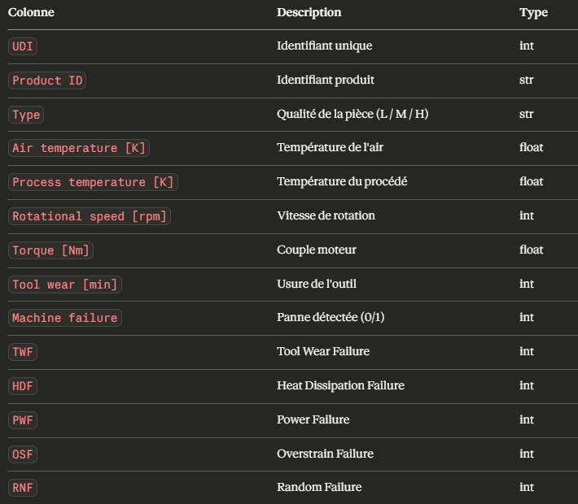
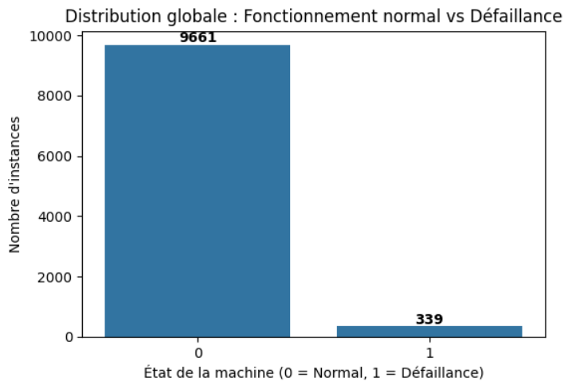
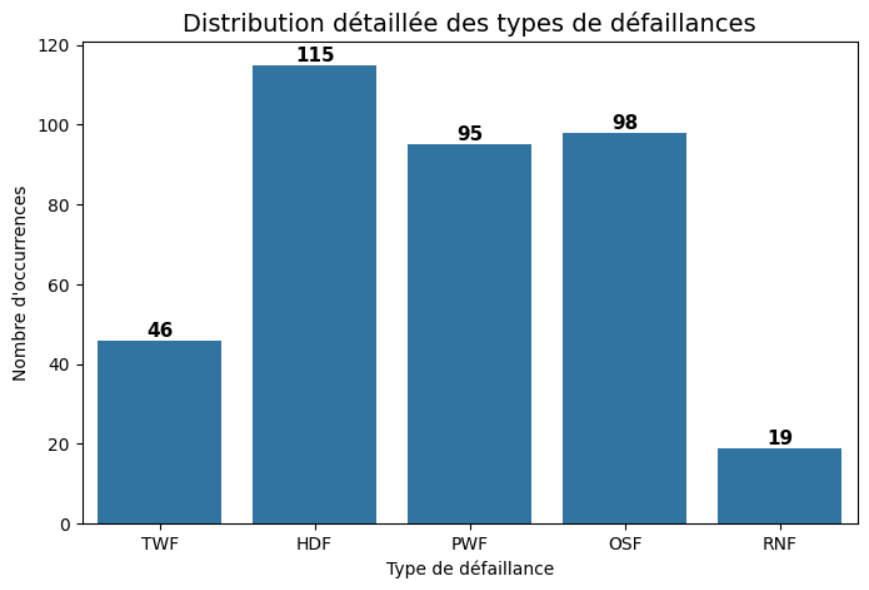
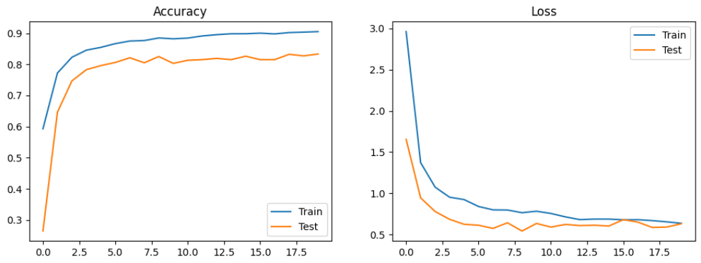
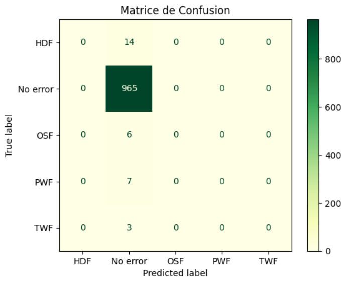
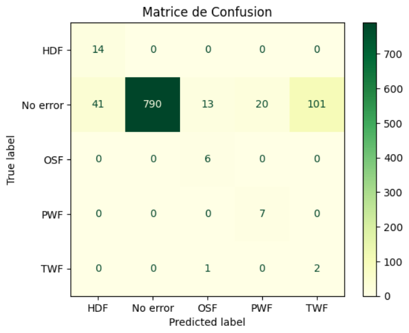
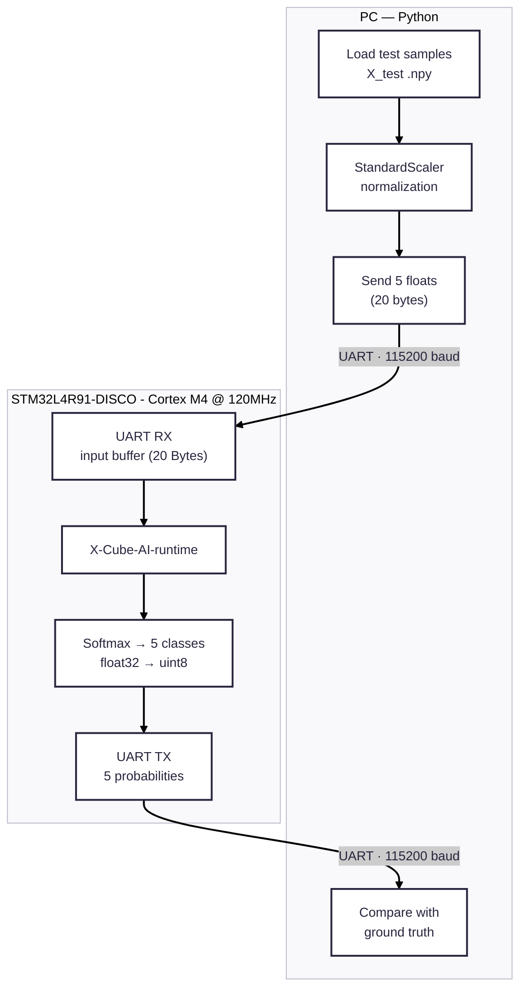

# TinyML Predictive Maintenance on STM32

**🇬🇧 English · [🇫🇷 Version française](#-version-française)**

Deep neural network for industrial predictive maintenance, trained from scratch and deployed on an STM32L4R9 microcontroller (ARM Cortex-M4). Full embedded ML pipeline from data preprocessing to on-device real-time inference.

**Authors:** Edouard LE · Laure RIVIER

---

## Key Results

| Metric | Value |
|---|---|
| Model footprint (Flash) | 12.3 KB weights · 22.9 KB with X-CUBE-AI runtime |
| RAM usage (activations) | 384 bytes |
| Inference latency | < 5 ms on Cortex-M4 @ 120 MHz |
| Parameters / MACC | 3,077 params · 3,264 MACC |
| Global accuracy | ~88% (on-target) |
| Target board | STM32L4R9I-DISCO |

> Deployed and validated on real hardware 

---

## Context and objective

This project covers the full development cycle of an embedded machine learning model: designing, training and deploying a deep neural network (DNN) for predictive maintenance, using the AI4I 2020 Predictive Maintenance Dataset, with final execution on an STM32L4R9 board.

1. Data preprocessing
2. Model design and training
3. Performance evaluation
4. Model conversion for an embedded target
5. Integration into an STM32CubeIDE project

Embedded AI is one of the defining engineering challenges today: it is no longer enough to design accurate models, they must run in drastically constrained environments, with a few hundred kilobytes of memory, limited compute and a tight power budget. Running inference close to the sensor brings lower latency, offline operation, better data privacy and greater system autonomy. This project illustrates the central trade-off of embedded AI: model accuracy versus resource frugality.

---

## Project structure

```
DNN_MAINTENANCE_PREDICTIVE_STM32
│
├── DNN_model                                # Machine failure prediction model
│   ├── DNN_model_failure_prediction.h5      # architecture + trained weights
│   ├── DNN_model_failure_prediction.tflite  # converted model used for inference
│   ├── predictive_maintenance_model.ipynb   # Jupyter notebook
│   ├── X_test_failure_prediction_v2.npy
│   ├── Y_test_failure_prediction_v2.npy
│   ├── ai4i2020.csv                         # dataset
│   ├── requirements.txt
│
├── STM32                                    # STM32CubeIDE files
│   ├── app_x-cube-ai.h
│   ├── app_x-cube-ai.c
│   ├── failure_prediction_analyze_report.txt
│   ├── main.h
│   ├── main.c
│
├── images
├── README.md
├── communication_STM32_NN.py                # sends sensor data to the STM32 over UART
│                                            # and checks predictions against expected labels
├── inference.txt                            # inference results
```

---

## Setup

Python dependencies: pandas, matplotlib, seaborn, numpy, imbalanced-learn, scikit-learn, tensorflow.

```bash
pip install -r requirements.txt
```

**Toolchain**
- Jupyter Notebook (VSCode or Google Colab) — training and analysis
- STM32CubeIDE — deployment to the microcontroller
- X-CUBE-AI — STMicroelectronics library to convert and run a deep learning model on STM32

---

## Quickstart

1. Train the model by running the notebook.
2. Export and convert the model to `.tflite`.
3. Import the `.tflite` and `.npy` files into X-CUBE-AI, analyze the model and generate the C code.
4. Build and flash the project onto the board via STM32CubeIDE.
5. Close STM32CubeIDE once flashing is complete.
6. Run the communication script:
   ```bash
   python communication_STM32_NN.py
   ```
7. Enter the board's COM port (e.g. `COM4`) and observe the inference results.

---

## Dataset

The AI4I 2020 Predictive Maintenance Dataset (UCI Machine Learning Repository) contains 10,000 observations and 14 columns describing the operating state of industrial machines and their associated failures.



No missing values, no duplicates — which limits bias from raw data quality.

**Class imbalance**



The dataset is heavily imbalanced: only 339 failures out of 10,000 observations (~3.4%). Breakdown by failure type:



### Anomalies and cleaning

Three inconsistencies were identified and fixed before any training:

1. **Failure type without machine failure** — some rows have a failure-type flag set to 1 (e.g. `RNF=1`) while `Machine failure=0`. Removed as labelling errors.
2. **Machine failure with no identified type** — 9 rows have `Machine failure=1` but all failure types at 0. Removed as unusable.
3. **Simultaneous multiple failures** — some rows have several failure types at 1. Removed to keep the multiclass problem consistent (one class per sample).

After cleaning, `RNF` disappears entirely from the dataset: all its occurrences were inconsistent cases.

---

## Pipeline

### Preprocessing

**Multiclass reformulation** : the original `Y` is a multi-label matrix (5 independent binary columns). It is converted to mutually exclusive classes via `idxmax` to identify the active failure, then `pd.get_dummies` for the final one-hot encoding. A `No Error` class is added explicitly for healthy machines, which is required in multiclass since the model must always pick exactly one class. Final classes: `[HDF, No Error, OSF, PWF, TWF]`.

**Split** : manual three-way split with fixed seed (`seed=42`): 80% train, 10% validation, 10% test.

**Normalization** : `StandardScaler` fitted on `X_train` only, then applied to `X_val` and `X_test` to avoid data leakage. After SMOTE, a second scaler is fitted on `X_train_bal` (statistics change with synthetic data) and applied to `X_val` and `X_test`.

**Rebalancing** : SMOTE (`sampling_strategy="auto"`) is used to bring all minority classes up to the majority class. SMOTE alone (without undersampling) was chosen because real failure data is scarce: reducing the majority class would worsen the information deficit. Data is shuffled after SMOTE, which orders samples by class.

### Model architecture

Sequential MLP:

```
Dense(64, relu) → BatchNorm → Dropout(0.5)
Dense(32, relu) → BatchNorm → Dropout(0.5)
Dense(16, relu) → Dropout(0.5)
Dense(5, softmax)
```

- `softmax` output: consistent with the multiclass problem (a single active class)
- Loss: `categorical_crossentropy`
- Optimizer: `Adam` (default learning rate)
- Batch size: 32; Epochs: 20

### Performance





**Without rebalancing**
The model predicts `No Error` in 100% of cases. Global accuracy reaches ~97% simply because that class represents ~97% of the dataset, but recall is zero on every failure class. The model learns no failure pattern at all.



**With SMOTE rebalancing** 
The model starts detecting failures:

| Class | Accuracy |
|---|---|
| `No Error` | 1.00 |
| `PWF` | 0.64 |
| `OSF` | 0.38 |
| `HDF` | 0.33 |
| `TWF` | 0.02 |

Disparities persist despite rebalancing: SMOTE generates synthetic samples that do not necessarily capture the real patterns of rare failures. Evaluation uses a single multiclass confusion matrix and `classification_report` (precision, recall, F1 per class).

---

## Deployment

### Target hardware

STM32L4R9I-DISCO, based on the STM32L4R9AI microcontroller (Cortex-M4, 120 MHz):

- **Flash:** 2 MB far more than needed for the model weights (12 KB)
- **RAM:** 640 KB model activations use only 384 bytes
- **FPU:** accelerates the model's float32 computations
- **USART1 (PB6/PB7):** PC communication via ST-LINK Virtual COM Port

With 3,077 parameters, 12 KB of weights and 3,264 MACC, the model fits the target with a very large margin.

### Model conversion

```python
converter = tf.lite.TFLiteConverter.from_keras_model(model)
tflite_model = converter.convert()
with open('DNN_model_failure_prediction.tflite', 'wb') as f:
    f.write(tflite_model)
```

The `.tflite` file is then imported into X-CUBE-AI (via STM32CubeIDE), which generates the embedded C code (`failure_prediction.c`, `failure_prediction_data.c`). Resource summary (see `failure_prediction_analyze_report.txt`):

| Resource | Model only | With X-CUBE-AI runtime | Board capacity |
|---|---|---|---|
| Flash (read-only) | 12.3 KB | ~22.9 KB (22,938 B) | 2 MB (>98% free) |
| RAM (read-write) | 384 B | ~2.8 KB (2,868 B) | 640 KB (>99% free) |
| Operations (MACC) | 3,264 | 3,264 | FPU-accelerated |

### Data flow architecture



### Embedded implementation

`app_x-cube-ai.c` orchestrates inference on the board:

1. **UART sync**: the board waits for byte `0xAB` from the PC, then replies `0xCD` to establish communication.
2. **Data reception** (`acquire_and_process_data`) : 20 bytes received over UART (5 floats × 4 bytes), copied into the model input buffer.
3. **Inference** (`ai_run`) : model execution via `ai_failure_prediction_run`.
4. **Result transmission** (`post_process`) : the 5 output probabilities (float32) are converted to uint8 (×255) and sent back over UART.

PC ↔ STM32 communication runs over USART1 at 115200 baud, on the ST-LINK virtual COM port.

The X-CUBE-AI analysis confirms the allocation of two 20-byte buffers (f32, shape 1×5) for input and output activations. These 20 bytes map exactly to the 5 float32 sensor variables sent by the Python script, confirming no data is lost in transmission.

---

## Results

### Desktop validation (X-CUBE-AI)

The on-desktop validation compares predictions from the original TFLite model (run on PC) with the converted C model. Both produce identical results, confirming that conversion does not degrade performance.

### On-target validation (STM32)

`communication_STM32_NN.py` sends the 995 samples of `X_test_failure_prediction_v2.npy` to the board and compares the received predictions against `Y_test_failure_prediction_v2.npy`. Results on the board are consistent with desktop performance (~88% global accuracy on the test set).

### Desktop vs embedded

| Metric | Desktop (Python) | Embedded (STM32) |
|---|---|---|
| Global accuracy | ~87% | ~88% |
| Flash footprint | 12 KB (`.tflite`) | 12.3 KB |
| Inference latency | < 1 ms | < 5 ms |
| Memory used | — | 384 B RAM |

> *Note on latency: measured on-board using the DWT cycle counter.*

The latency difference is explained by clock frequency (120 MHz on the STM32 vs GHz on PC) and remains negligible for an industrial maintenance application.

---

## Future work

### Quantization (analysis)

The current model runs in float32 (FPU-accelerated on the Cortex-M4). Post-training INT8 quantization via TFLite (`converter.optimizations = [tf.lite.Optimize.DEFAULT]` with a representative dataset) would cut the flash footprint by ~4× and speed up inference on cores without an FPU, at the cost of some accuracy degradation. Expected gains, to be validated experimentally:

| | Float32 (current) | INT8 (estimated) |
|---|---|---|
| Flash (weights) | 12.3 KB | ~3 KB |
| Accuracy | ~88% | to be measured (typically 1–3 pts drop) |

On this 3,077-parameter MLP the benefit is mainly pedagogical : the model already fits the target with a wide margin. The gain becomes decisive on heavier models or on microcontrollers without an FPU.

### Models and data

- **Improve TWF detection**
  Recall stays very low (~0.02) due to the scarcity of real samples. More targeted data augmentation or ADASYN oversampling could help.
- **Test other architectures**
   1D CNN or LSTM if temporal data is available, to capture progressive degradation patterns.
- **Adaptive thresholding** instead of a plain `argmax`, apply per-class confidence thresholds to better handle residual imbalance.

### Embedded and system

- **On-device normalization**
  data is currently normalized on the PC before transmission. Embedding the `StandardScaler` on the STM32 would allow use with real sensors without external preprocessing.
- **Real sensor acquisition**
  connect actual sensors (temperature, torque, speed) to the board for an end-to-end demo without a PC in the loop.
- **Result display**
  use the OLED screen or LEDs of the STM32L4R9I-DISCO to show the predicted class in real time, without a serial terminal.
- **Power profiling**
  profile and optimize consumption during inference, exploiting the STM32L4 low-power modes between inferences.

---

## Conclusion

This project covers the entire development cycle of an embedded AI model, from data preparation to on-device inference. The main challenge was not designing the model itself, but deploying it: correct UART configuration, PC/STM32 synchronization protocol, data type handling (float32, endianness) and compatibility between the X-CUBE-AI firmware and the application code.

The result is a working system that classifies 5 machine states (HDF, No Error, OSF, PWF, TWF) in real time on an STM32, with 88% accuracy and a memory footprint of only 384 bytes of RAM, a concrete illustration of the performance/frugality trade-off at the heart of embedded AI.

<br>

---

<br>

# 🇫🇷 Version française

**[🇬🇧 English version](#tinyml-predictive-maintenance-on-stm32) · 🇫🇷 Français**

Réseau de neurones profond pour la maintenance prédictive industrielle, entraîné puis déployé sur un microcontrôleur STM32L4R9 (ARM Cortex-M4). Chaîne complète d'IA embarquée : du prétraitement des données à l'inférence temps réel on-device.

**Auteurs :** Edouard LE · Laure RIVIER

---

## Résultats clés

| Métrique | Valeur |
|---|---|
| Empreinte modèle (Flash) | 12,3 KB de poids · 22,9 KB avec le runtime X-CUBE-AI |
| RAM (activations) | 384 octets |
| Latence d'inférence | < 5 ms sur Cortex-M4 @ 120 MHz |
| Paramètres / MACC | 3 077 params · 3 264 MACC |
| Accuracy globale | ~88 % (sur cible) |
| Carte cible | STM32L4R9I-DISCO |

> Déployé et validé sur matériel réel

---

## Contexte et objectif

Ce projet couvre l'intégralité du cycle de développement d'un modèle de machine learning embarqué : concevoir, entraîner et déployer un réseau de neurones profond (DNN) de maintenance prédictive, à partir du jeu de données AI4I 2020 Predictive Maintenance Dataset, avec exécution finale sur carte STM32L4R9.

1. Prétraitement des données
2. Conception et entraînement du modèle
3. Évaluation des performances
4. Conversion du modèle pour une cible embarquée
5. Intégration dans un projet STM32CubeIDE

L'IA embarquée représente l'un des défis majeurs de l'ingénierie moderne : il ne s'agit plus seulement de concevoir des modèles performants, mais de les faire fonctionner dans des environnements aux ressources drastiquement limitées : quelques centaines de kilooctets de mémoire, une puissance de calcul réduite, une consommation contrainte. Embarquer l'intelligence au plus près des capteurs apporte une latence réduite, un fonctionnement hors-ligne, une meilleure confidentialité et une autonomie accrue. Ce projet illustre le compromis central de l'IA embarquée : précision du modèle contre frugalité des ressources.

---

## Structure du projet

```
DNN_MAINTENANCE_PREDICTIVE_STM32
│
├── DNN_model                                # Modèle de prédiction des pannes machines
│   ├── DNN_model_failure_prediction.h5      # architecture + poids entraînés
│   ├── DNN_model_failure_prediction.tflite  # modèle converti utilisé pour l'inférence
│   ├── predictive_maintenance_model.ipynb   # Jupyter Notebook
│   ├── X_test_failure_prediction_v2.npy
│   ├── Y_test_failure_prediction_v2.npy
│   ├── ai4i2020.csv                         # dataset
│   ├── requirements.txt
│
├── STM32                                    # Fichiers STM32CubeIDE
│   ├── app_x-cube-ai.h
│   ├── app_x-cube-ai.c
│   ├── failure_prediction_analyze_report.txt
│   ├── main.h
│   ├── main.c
│
├── images
├── README.md
├── communication_STM32_NN.py                # envoie les données capteurs à la STM32 via UART
│                                            # et vérifie les prédictions contre les labels attendus
├── inference.txt                            # résultats de l'inférence
```

---

## Installation et prérequis

Bibliothèques Python : pandas, matplotlib, seaborn, numpy, imbalanced-learn, scikit-learn, tensorflow.

```bash
pip install -r requirements.txt
```

**Environnement de travail**
- Jupyter Notebook (VSCode ou Google Colab) — développement, entraînement, analyse
- STM32CubeIDE — déploiement sur microcontrôleur
- X-CUBE-AI — bibliothèque STMicroelectronics pour convertir et exécuter un modèle de deep learning sur STM32

---

## Quickstart

1. Entraîner le modèle en exécutant le notebook.
2. Exporter et convertir le modèle au format `.tflite`.
3. Importer les fichiers `.tflite` et `.npy` dans X-CUBE-AI, analyser le modèle et générer le code C.
4. Compiler et flasher le projet sur la carte via STM32CubeIDE.
5. Fermer STM32CubeIDE une fois le flash terminé.
6. Lancer le script de communication :
   ```bash
   python communication_STM32_NN.py
   ```
7. Entrer le port COM de la carte (ex. `COM4`) et observer les résultats d'inférence.

---

## Dataset

Le AI4I 2020 Predictive Maintenance Dataset (UCI Machine Learning Repository) contient 10 000 observations et 14 colonnes décrivant l'état de fonctionnement de machines industrielles et les pannes associées.


Aucune valeur manquante ni doublon, ce qui limite les biais liés à la qualité des données brutes.

**Déséquilibre des classes**


Le dataset est fortement déséquilibré : seulement 339 pannes sur 10 000 observations (~3,4 %). Répartition par type de panne :


### Anomalies et nettoyage

Trois incohérences identifiées et corrigées avant tout entraînement :

1. **Type de panne sans Machine failure** — certaines lignes ont un flag de type de panne à 1 (ex. `RNF=1`) alors que `Machine failure=0`. Supprimées : erreur d'étiquetage.
2. **Machine failure sans type identifié** — 9 lignes ont `Machine failure=1` mais tous les types à 0. Supprimées : inexploitables.
3. **Pannes multiples simultanées** — certaines lignes cumulent plusieurs types de panne. Supprimées pour garantir la cohérence du problème multiclasse (une seule classe par exemple).

Après nettoyage, `RNF` disparaît entièrement du dataset : toutes ses occurrences correspondaient à des cas incohérents.

---

## Pipeline

### Prétraitement

**Reformulation en multiclasse**
Le `Y` original est une matrice multi-label (5 colonnes binaires indépendantes). Il est converti en classes mutuellement exclusives via `idxmax` pour identifier la panne active, puis `pd.get_dummies` pour l'encodage one-hot final. Une classe `No Error` est ajoutée explicitement pour les machines saines, indispensable en multiclasse car le modèle doit toujours désigner exactement une classe. Classes finales : `[HDF, No Error, OSF, PWF, TWF]`.

**Split** division manuelle avec seed fixe (`seed=42`) : 80 % train, 10 % validation, 10 % test.

**Normalisation** 
`StandardScaler` fitté sur `X_train` uniquement, puis appliqué à `X_val` et `X_test` pour éviter toute fuite d'information. Après SMOTE, un second scaler est fitté sur `X_train_bal` (les statistiques ayant changé avec les données synthétiques) et appliqué à `X_val` et `X_test`.

**Rééquilibrage** 
SMOTE (`sampling_strategy="auto"`) pour monter les classes minoritaires au niveau de la classe majoritaire. SMOTE seul (sans undersampling) est motivé par la rareté des données réelles de pannes : réduire la classe majoritaire aggraverait le manque d'information. Les données sont mélangées après SMOTE, qui ordonne les exemples par classe.

### Architecture du modèle

MLP séquentiel :

```
Dense(64, relu) → BatchNorm → Dropout(0.5)
Dense(32, relu) → BatchNorm → Dropout(0.5)
Dense(16, relu) → Dropout(0.5)
Dense(5, softmax)
```

- `softmax` en sortie — cohérent avec le problème multiclasse (une seule classe active)
- Loss : `categorical_crossentropy`
- Optimiseur : `Adam` (learning rate par défaut)
- Batch size : 32 — Epochs : 20

### Performances


**Sans rééquilibrage** 
Le modèle prédit systématiquement `No Error` dans 100 % des cas. L'accuracy globale atteint ~97 % uniquement parce que cette classe représente ~97 % du dataset, mais le recall est nul sur toutes les classes de pannes. Le modèle n'apprend aucun pattern de défaillance.


**Avec rééquilibrage (SMOTE)** 
Le modèle commence à détecter les pannes :

| Classe | Accuracy |
|---|---|
| `No Error` | 1,00 |
| `PWF` | 0,64 |
| `OSF` | 0,38 |
| `HDF` | 0,33 |
| `TWF` | 0,02 |

Les disparités persistent malgré l'équilibrage : SMOTE génère des exemples synthétiques qui ne capturent pas nécessairement les patterns réels des pannes rares. L'évaluation est réalisée via matrice de confusion unique (multiclasse) et `classification_report` (précision, rappel, F1 par classe).

---

## Déploiement

### Matériel cible

STM32L4R9I-DISCO, basée sur le microcontrôleur STM32L4R9AI (Cortex-M4, 120 MHz) :

- **Flash :** 2 MB largement suffisant pour les poids du modèle (12 KB)
- **RAM :** 640 KB les activations n'occupent que 384 octets
- **FPU :** accélère les calculs float32 du modèle
- **USART1 (PB6/PB7) :** communication avec le PC via ST-LINK Virtual COM Port

Avec 3 077 paramètres, 12 KB de poids et 3 264 MACC, le modèle s'adapte sans difficulté aux contraintes de la carte.

### Conversion du modèle

```python
converter = tf.lite.TFLiteConverter.from_keras_model(model)
tflite_model = converter.convert()
with open('DNN_model_failure_prediction.tflite', 'wb') as f:
    f.write(tflite_model)
```

Le `.tflite` est ensuite importé dans X-CUBE-AI (via STM32CubeIDE), qui génère le code C embarqué (`failure_prediction.c`, `failure_prediction_data.c`). Résumé des ressources (voir `failure_prediction_analyze_report.txt`) :

| Ressource | Modèle seul | Avec runtime X-CUBE-AI | Capacité carte |
|---|---|---|---|
| Flash (read-only) | 12,3 KB | ~22,9 KB (22 938 o) | 2 MB (>98 % libre) |
| RAM (read-write) | 384 o | ~2,8 KB (2 868 o) | 640 KB (>99 % libre) |
| Opérations (MACC) | 3 264 | 3 264 | Accéléré par FPU |

### Architecture du flux de données


### Implémentation embarquée

`app_x-cube-ai.c` orchestre l'inférence sur la carte :

1. **Synchronisation UART** : la carte attend un octet `0xAB` du PC, puis répond `0xCD` pour établir la communication.
2. **Réception des données** (`acquire_and_process_data`) : 20 octets reçus via UART (5 floats × 4 octets), copiés dans le buffer d'entrée du modèle.
3. **Inférence** (`ai_run`) : exécution via `ai_failure_prediction_run`.
4. **Envoi des résultats** (`post_process`) : les 5 probabilités de sortie (float32) sont converties en uint8 (×255) et transmises via UART.

La communication PC ↔ STM32 s'effectue via USART1 à 115200 baud, sur le port COM virtuel ST-LINK.

L'analyse X-CUBE-AI confirme l'allocation de deux buffers de 20 octets (f32, dimension 1×5) pour les activations d'entrée et de sortie. Ces 20 octets correspondent exactement aux 5 variables capteurs (float32) envoyées par le script Python, confirmant qu'aucune donnée n'est perdue en transmission.

---

## Résultats

### Validation sur desktop (X-CUBE-AI)

La validation on-desktop compare les prédictions du modèle TFLite original (exécuté sur PC) avec celles du modèle converti en code C. Les deux produisent des résultats identiques, confirmant que la conversion ne dégrade pas les performances.

### Validation sur cible (STM32)

`communication_STM32_NN.py` envoie les 995 échantillons de `X_test_failure_prediction_v2.npy` à la carte et compare les prédictions reçues avec `Y_test_failure_prediction_v2.npy`. Les résultats sur carte sont cohérents avec les performances desktop (~88 % d'accuracy globale).

### Comparaison desktop vs embarqué

| Métrique | Desktop (Python) | Embarqué (STM32) |
|---|---|---|
| Accuracy globale | ~87 % | ~88 % |
| Empreinte Flash | 12 KB (`.tflite`) | 12,3 KB |
| Latence d'inférence | < 1 ms | < 5 ms |
| Mémoire utilisée | — | 384 o RAM |

> *Note sur la latence : mesurée sur carte via le compteur de cycles DWT.*

L'écart de latence s'explique par la fréquence d'horloge (120 MHz sur STM32 vs GHz sur PC) et reste négligeable pour une application de maintenance industrielle.

---

## Pistes d'amélioration

### Quantization (analyse)

Le modèle actuel tourne en float32 (accéléré par le FPU du Cortex-M4). Une quantization post-training INT8 via TFLite (`converter.optimizations = [tf.lite.Optimize.DEFAULT]` avec un representative dataset) réduirait l'empreinte flash d'un facteur ~4 et accélérerait l'inférence sur cœurs sans FPU, au prix d'une dégradation d'accuracy à mesurer. Gains attendus, à valider expérimentalement :

| | Float32 (actuel) | INT8 (estimé) |
|---|---|---|
| Flash (poids) | 12,3 KB | ~3 KB |
| Accuracy | ~88 % | à mesurer (dégradation typique 1–3 pts) |

Sur ce MLP de 3 077 paramètres, l'intérêt est surtout pédagogique : le modèle tient déjà largement dans la cible. Le gain devient décisif sur des modèles plus lourds ou des microcontrôleurs sans FPU.

### Modèles et données

- **Améliorer la détection de TWF** : le recall reste très faible (~0,02) faute d'exemples réels. Une data augmentation plus ciblée ou un sur-échantillonnage ADASYN pourraient aider.
- **Tester d'autres architectures** : CNN 1D ou LSTM si des données temporelles sont disponibles, pour capturer des patterns de dégradation progressive.
- **Seuillage adaptatif** : plutôt qu'un simple `argmax`, appliquer des seuils de confiance par classe pour mieux gérer le déséquilibre résiduel.

### Embarqué et système

- **Normalisation embarquée** : les données sont actuellement normalisées côté PC avant envoi. Intégrer le `StandardScaler` sur la STM32 permettrait une utilisation avec de vrais capteurs sans preprocessing externe.
- **Acquisition capteurs réelle** : connecter de vrais capteurs (température, couple, vitesse) pour une démonstration end-to-end sans PC intermédiaire.
- **Interface de résultat** : exploiter l'écran OLED ou les LEDs de la STM32L4R9I-DISCO pour afficher la classe prédite en temps réel, sans terminal série.
- **Consommation énergétique** : profiler et optimiser la consommation pendant l'inférence, en exploitant les modes basse consommation du STM32L4 entre deux inférences.

---

## Conclusion

Ce projet a permis de parcourir l'intégralité du cycle de développement d'un modèle d'IA embarquée, de la préparation des données jusqu'à l'inférence sur microcontrôleur. Le principal défi n'a pas été la conception du modèle lui-même, mais son déploiement : configuration correcte de l'UART, protocole de synchronisation PC/STM32, gestion des types de données (float32, endianness) et compatibilité entre le firmware X-CUBE-AI et le code applicatif.

Le résultat final est un système fonctionnel capable de classifier 5 types d'états machine (HDF, No Error, OSF, PWF, TWF) en temps réel sur une STM32, avec une accuracy de 88 % et une empreinte mémoire de seulement 384 octets de RAM illustrant concrètement le compromis performance/frugalité au cœur de l'IA embarquée.
